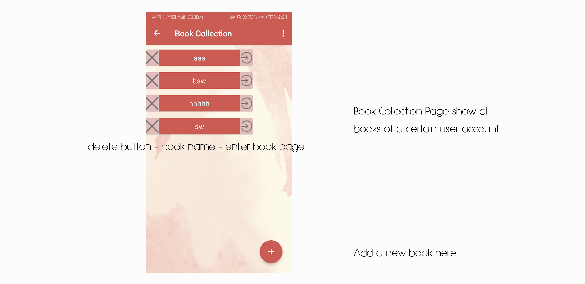

# Readme
 

The frontend part of our Software Engineering homework.(?)

Completely a rookie to Android, mainly using the ViewPager template to modify. Complete some basic problems such as register and login, left-right switching, and jumps. By the way, the refresh function is poorly implemented.

It looks like this:

##### Splash Page

##### Register & Login Page

##### Main Page

Main Page includes three fragments: Translate Fragment, Home Fragment and User Fragment.

#####Search Page

##### UserInfo Setting Page

##### Book(Bag) Collection Page

#####Book(Bag) Page

#####Card Page

Hope this may help.(probably not I think :)

##### 